# 실행 계획

## 상세 분석 요약

### 변경 영향 평가
- **사용자 대면 변경**: 예 - 고객용 웹앱, 관리자용 웹앱 신규 구축
- **구조적 변경**: 예 - 전체 시스템 아키텍처 신규 설계
- **데이터 모델 변경**: 예 - 매장, 테이블, 메뉴, 옵션, 주문 등 전체 스키마 설계
- **API 변경**: 예 - REST API 전체 설계 (인증, 메뉴, 주문, 관리 등)
- **NFR 영향**: 예 - 보안(Security Baseline 15개 규칙), 성능(2초 폴링), 확장성(다중 매장)

### 위험 평가
- **위험 수준**: 중간 (Medium)
- **근거**: 신규 프로젝트로 롤백 불필요, 하지만 다중 컴포넌트, 실시간 기능, 보안 규칙 적용 등 복잡도 있음
- **롤백 복잡도**: 낮음 (Greenfield)
- **테스트 복잡도**: 복잡 (단위 + 통합 + E2E)

---

## 워크플로우 시각화

```mermaid
flowchart TD
    Start(["사용자 요청"])
    
    subgraph INCEPTION["INCEPTION 단계"]
        WD["Workspace Detection<br/><b>COMPLETED</b>"]
        RA["Requirements Analysis<br/><b>COMPLETED</b>"]
        US["User Stories<br/><b>COMPLETED</b>"]
        WP["Workflow Planning<br/><b>COMPLETED</b>"]
        AD["Application Design<br/><b>EXECUTE</b>"]
        UG["Units Generation<br/><b>EXECUTE</b>"]
    end
    
    subgraph CONSTRUCTION["CONSTRUCTION 단계"]
        FD["Functional Design<br/><b>EXECUTE</b>"]
        NFRA["NFR Requirements<br/><b>EXECUTE</b>"]
        NFRD["NFR Design<br/><b>EXECUTE</b>"]
        ID["Infrastructure Design<br/><b>EXECUTE</b>"]
        CG["Code Generation<br/><b>EXECUTE</b>"]
        BT["Build and Test<br/><b>EXECUTE</b>"]
    end
    
    Start --> WD
    WD --> RA
    RA --> US
    US --> WP
    WP --> AD
    AD --> UG
    UG --> FD
    FD --> NFRA
    NFRA --> NFRD
    NFRD --> ID
    ID --> CG
    CG --> BT
    BT --> End(["완료"])
    
    style WD fill:#4CAF50,stroke:#1B5E20,stroke-width:3px,color:#fff
    style RA fill:#4CAF50,stroke:#1B5E20,stroke-width:3px,color:#fff
    style US fill:#4CAF50,stroke:#1B5E20,stroke-width:3px,color:#fff
    style WP fill:#4CAF50,stroke:#1B5E20,stroke-width:3px,color:#fff
    style AD fill:#FFA726,stroke:#E65100,stroke-width:3px,stroke-dasharray: 5 5,color:#000
    style UG fill:#FFA726,stroke:#E65100,stroke-width:3px,stroke-dasharray: 5 5,color:#000
    style FD fill:#FFA726,stroke:#E65100,stroke-width:3px,stroke-dasharray: 5 5,color:#000
    style NFRA fill:#FFA726,stroke:#E65100,stroke-width:3px,stroke-dasharray: 5 5,color:#000
    style NFRD fill:#FFA726,stroke:#E65100,stroke-width:3px,stroke-dasharray: 5 5,color:#000
    style ID fill:#FFA726,stroke:#E65100,stroke-width:3px,stroke-dasharray: 5 5,color:#000
    style CG fill:#4CAF50,stroke:#1B5E20,stroke-width:3px,color:#fff
    style BT fill:#4CAF50,stroke:#1B5E20,stroke-width:3px,color:#fff
    style Start fill:#CE93D8,stroke:#6A1B9A,stroke-width:3px,color:#000
    style End fill:#CE93D8,stroke:#6A1B9A,stroke-width:3px,color:#000
    style INCEPTION fill:#BBDEFB,stroke:#1565C0,stroke-width:3px,color:#000
    style CONSTRUCTION fill:#C8E6C9,stroke:#2E7D32,stroke-width:3px,color:#000
    
    linkStyle default stroke:#333,stroke-width:2px
```



### 텍스트 대안
```
Phase 1: INCEPTION
  - Workspace Detection (COMPLETED)
  - Requirements Analysis (COMPLETED)
  - User Stories (COMPLETED)
  - Workflow Planning (COMPLETED)
  - Application Design (EXECUTE)
  - Units Generation (EXECUTE)

Phase 2: CONSTRUCTION (Unit별 반복)
  - Functional Design (EXECUTE)
  - NFR Requirements (EXECUTE)
  - NFR Design (EXECUTE)
  - Infrastructure Design (EXECUTE)
  - Code Generation (EXECUTE)
  - Build and Test (EXECUTE)

Phase 3: OPERATIONS
  - Operations (PLACEHOLDER)
```

---

## 실행할 단계

### INCEPTION 단계
- [x] Workspace Detection (COMPLETED)
- [x] Requirements Analysis (COMPLETED)
- [x] User Stories (COMPLETED)
- [x] Workflow Planning (COMPLETED)
- [ ] Application Design - **EXECUTE**
  - **근거**: 신규 시스템으로 컴포넌트 식별, 서비스 레이어 설계, 컴포넌트 간 의존성 정의 필요
- [ ] Units Generation - **EXECUTE**
  - **근거**: 백엔드 API, 고객 웹앱, 관리자 웹앱 등 다중 유닛으로 분해 필요

### CONSTRUCTION 단계 (Contract First 병렬 전략)

#### backend-api (설계 완료)
- [x] Functional Design - **COMPLETED**
- [x] NFR Requirements - **COMPLETED**
- [x] NFR Design - **COMPLETED**
- [x] Infrastructure Design - **COMPLETED**

#### Phase 1: shared (API 계약)
- [ ] Code Generation - **EXECUTE**
  - **근거**: OpenAPI 스펙, TypeScript 타입, MSW mock 핸들러 → 병렬 개발 기반

#### Phase 2: 병렬 개발 (3개 유닛 동시)
- [ ] Code Generation: backend-api - **EXECUTE**
  - **근거**: API 계약의 실제 구현 (TDD)
- [ ] Code Generation: customer-web - **EXECUTE**
  - **근거**: MSW mock 기반 고객 UI 개발
- [ ] Code Generation: admin-web - **EXECUTE**
  - **근거**: MSW mock 기반 관리자 UI 개발

#### 통합 및 테스트
- [ ] Build and Test - **EXECUTE** (항상)
  - **근거**: Mock → 실제 API 전환 통합 테스트, E2E 테스트

### OPERATIONS 단계
- [ ] Operations - **PLACEHOLDER**
  - **근거**: 향후 배포 및 모니터링 워크플로우 확장 예정

## 건너뛸 단계
- Reverse Engineering - **SKIP** (Greenfield 프로젝트, 기존 코드 없음)

---

## 유닛 구성 (Contract First 병렬 전략)

| 유닛 | 설명 | 기술 스택 | Phase |
|------|------|-----------|-------|
| **shared** | API 계약 (OpenAPI + 타입 + MSW mock) | TypeScript | Phase 1 |
| **backend-api** | REST API 서버 (계약 구현) | Python + FastAPI + PostgreSQL | Phase 2 |
| **customer-web** | 고객용 SPA (mock → 실제 API) | React + Vite (모바일 최적화) | Phase 2 (병렬) |
| **admin-web** | 관리자용 SPA (mock → 실제 API) | React + Vite (데스크톱 최적화) | Phase 2 (병렬) |

---

## 성공 기준
- **주요 목표**: 고객 주문 → 관리자 모니터링의 전체 플로우 동작
- **핵심 산출물**: 
  - 동작하는 백엔드 API (인증, 메뉴, 주문, 관리)
  - 고객용 웹앱 (메뉴 탐색, 옵션, 장바구니, 추천, 주문, 대기)
  - 관리자용 웹앱 (대시보드, 테이블/메뉴 관리)
  - Docker 컨테이너화
  - 단위/통합/E2E 테스트
- **품질 게이트**:
  - Security Baseline 15개 규칙 준수
  - INVEST 기준 충족 스토리별 인수 기준 통과
  - 2초 이내 폴링 기반 주문 갱신
